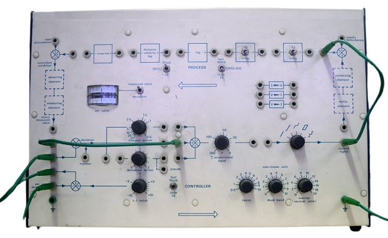

## Introduction

<b>Discipline | <b> Electrical Engineering 
:--|:--|
<b> Lab | <b> **Control and Instrumentation Lab**
<b> Experiment|     <b> **Study and operation of the Process Simulator set up and Experiment 8**

### About the Experiment 
**System description**

The Process Control Simulator is a special-purpose analogue simulator employing integrated circuit operational amplifiers.Number of variable interconnections together with a range of non-linear functions permit a detailed study of the dynamic responses of a wide variety of linear and non-linear processes and the application of proportional, integral, derivative modes of control. Provision is made for the process characteristics and controller configuration to be preset.

<b style="color:blue">Functional Description</b>

A power on-off switch and indicator lamp are mounted on the left-hand side of the case. Range of all input and output signals is &plusmn; 10V.  

<figcaption style="color:blue">Fig1.Process Control Simulator kit</figcaption>

<b>Name of Developer | <b> **Prof. Alok Kanti Deb**
:--|:--|
<b> Institute | <b>  **Indian Institute of Technology Kharagpur**
<b> Email id|     <b>  **alokkanti@ee.iitkgp.ac.in**
<b> Department |  **Department of Electrical Engineering**
<b>Webpage| <b> http://www.iitkgp.ac.in/department/EE/faculty/ee-alokkanti

### Contributors List

SrNo | Name | VLabs Developer or Integration Engineer | Designation | Department| Institute
:--|:--|:--|:--|:--|:--|
1 | **Piyali Chattopadhyay** | Developer & Integration | Project Scientist | Department of Electrical Engineering | IIT Kharagpur | 
