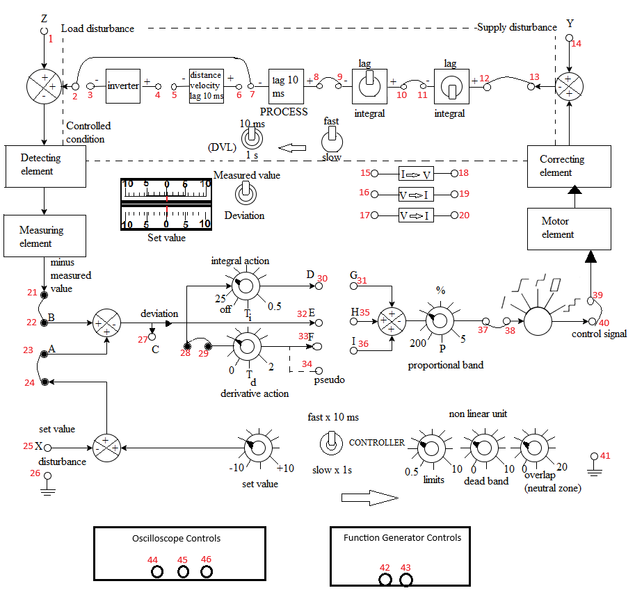
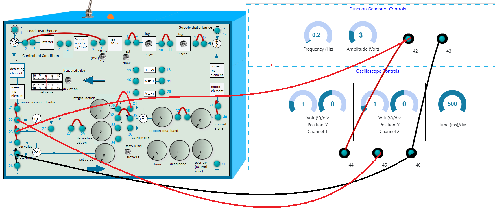

### Procedure

 
<b>Fig. 1. Schematic of the Process Control Simulator with oscilloscope and function generator</b>

 

**Steps to perform the simulation**

<ol>
<b>P Control</b>
<li>First make the wire connection properly through the connecting dots (blue dots) in the process simulator kit (shown in Fig. 2) in simulation section, following the below instructions. 

<ul>
<li><b>Note:</b> Example: connection point 1 - connection point 2 (drag the wire from connection point 1 by pressing left mouse button and release on connection point 2).</li>
<li>2-7, 8-9, 10-11, 12-13, 21-22, 23-24, 37-38, 39-40, 28-29, 25-26, 23-42, 44-42, 46-43, 46-25 and 32-35 for proportional control.</li> 
   

 
<b>Fig. 2. Wire connection in simulation for P Control to get output signal</b>

 

<li>45-22, 45-27 connections can be done for showing output signal or deviation signal respectively in oscilloscope channel-2 alternatively.</li>
<li>Connect 45-22 now.</li>
<li><b>Note:</b> Any wire connection can be deleted by clicking on the connected wire if required.</li>
</ul></li> 

<li><ul><li>Click on 'Check Connection' button to check whether the connection is proper or not. Switch on the plant by clicking on the toggle switch above it. The led will glow.</li>
<li>Click on the 'Power' button to switch on the oscilloscope.</li></ul></li> 

<li>Click on "Square" button (twice) to observe input signal. Apply amplitude to 5 Vp-p, frequency 0.2 Hz. </li> 

<li><ul><li>Apply 50 percent proportional band by rotating the 'proportional band' knob. </li>
<li><b>Note:</b> To rotate any knob put the mouse cursor on the knob handle (black line on the knob), a hand symbol will be showing. Press left mouse button, rotate clockwise to increase or anticlockwise to decrease values.</li>
<li><b>Note:</b> If the desired value does not appear while rotating the knob in one attempt, try rotating it back and forth to reach the correct value.</li>
</ul></li> 

<li><ul><li>Now click on 'Output' button to observe the output signal and enlarged signal plot for the particular proportional band.</li>
<li>Channel-1 will show the input, Channel-2 will show the output and 'Dual' shows both the input and output signals.</li> 
<li>In the plot (at the bottom of the page during simulation) zoom in the overshoot part of the curve by selecting that part (hold the left mouse button and select the area).</li>
<li>Enter the peak value and steady state value in respective input boxes.</li>
<li>Click on 'Calculate' button. Observe the steady state error and percentage overshoot.</li>
<li>Click on 'Clear' button. Power off the oscilloscope.</li></ul></li> 					 

<li><ul><li>Delete connection 45-22 by clicking on the connected wire and connect 45-27.</li>
<li>Click on 'Check Connection' button to check whether the connection is proper or not.</li> 
<li>Power on the oscilloscope. Now follow steps 3-5 to observe the deviation signal.</li></ul></li> 					 

<li><ul><li>Click on 'Clear' button each time after one observation.</li>
<li>Check output and deviation for 30,200,5 percent proportional band 
following steps 1-6.</li>
<li>Power off the oscilloscope.</li></ul></li> 

  
</ol>
<ol>
<b>PI Control</b>
<li>First make the wire connection properly through the connecting dots (blue dots) in the process simulator kit (shown in Fig. 3) in simulation section, following the below instructions. 

<ul><li>2-7, 8-9, 10-11, 12-13, 21-22, 23-24, 37-38, 39-40, 28-29, 25-26, 23-42, 44-42, 46-43, 46-25 and 32-35, 30-31 for proportional integral control.</li> 
 

 
<b>Fig. 3. Wire connection in simulation for PI Control to get output signal</b>

 
<li>45-22, 45-27 connections can be done for showing output signal or deviation signal respectively in oscilloscope channel-2 alternatively.</li>
<li>Connect 45-22 now.</li></ul></li> 

<li><ul><li>Click on 'Check Connection' button to check whether the connection is proper or not.</li>
<li>Click on the 'Power' button to switch on the oscilloscope.</li></ul></li> 

<li>Click on "Square" button (twice) to observe input signal. Apply amplitude to 5 Vp-p, frequency 0.2 Hz. </li> 

<li>Apply 100 percent proportional band by rotating the 'proportional band' knob (this will be fixed) and apply integral time 2 by rotating the 'integral action' knob. </li> 

<li><ul><li>Now click on 'Output' button to observe the output signal and the enlarged signal plot for the particular integral time.</li>
<li>Channel-1 will show the input, Channel-2 will show the output and 'Dual' shows both the input and output signals.</li> 
<li>In the plot (at the bottom of the page during simulation) zoom in the overshoot part of the curve by selecting that part (hold the left mouse button and select the area).</li>
<li>Enter the peak value and steady state value (if overshoots are there) in respective input boxes.</li>
<li>Click on 'Calculate' button. Observe the steady state error and percentage overshoot.</li>
<li>Click on 'Clear' button. Power off the oscilloscope.</li></ul></li> 					 

<li><ul><li>Delete connection 45-22 by clicking on the connected wire and connect 45-27.</li>
<li>Click on 'Check Connection' button to check whether the connection is proper or not.</li> 
<li>Power on the oscilloscope. Now follow steps 3-5 to observe the deviation signal. </li></ul></li> 

<li><ul><li>Click on 'Clear' button each time after one observation.</li>
<li>Check output and deviation by setting integral time to 5,10,25 following steps 1-6.</li>
<li>Power off the oscilloscope.</li></ul></li> 

  
</ol>
<ol>					
<b>PID Control</b>
<li>First make the wire connection properly through the connecting dots (blue dots) in the process simulator kit (shown in Fig. 4) in simulation section, following the below instructions.  

<ul><li>2-7, 8-9, 10-11, 12-13, 21-22, 23-24, 37-38, 39-40, 28-29, 25-26, 23-42, 44-42, 46-43, 46-25 and 32-35, 30-31, 33-36 for proportional integral derivative control.</li>
 

 
<b>Fig. 4. Wire connection in simulation for PID Control to get output signal</b>

 					  
<li>45-22, 45-27 connections can be done for showing output signal
or deviation signal respectively in oscilloscope channel-2 alternatively.</li>
<li>Connect 45-22 now.</li></ul></li> 

<li><ul><li>Click on 'Check Connection' button to check whether the connection is proper or not.</li>
<li>Click on the 'Power' button to switch on the oscilloscope.</li></ul></li> 

<li>Click on "Square" button (twice) to observe input signal. Apply amplitude to 5 Vp-p, frequency 0.2 Hz. </li> 

<li><ul><li>Apply 50 percent proportional band by rotating the 'proportional band' knob (this will be fixed).</li>
<li>Apply integral time 2 by rotating the 'integral action' knob (this will be fixed).</li>
<li>Apply derivative time to 2 by rotating the 'derivative action' knob. </li></ul></li> 

<li><ul><li>Now click on 'Output' button to observe the output signal and the enlarged signal plot for the particular derivative time.</li>
<li>Channel-1 will show the input, Channel-2 will show the output and 'Dual' shows both the input and output signals.</li> 
<li>In the plot (at the bottom of the page during simulation) zoom in the overshoot part of the curve by selecting that part (hold the left mouse button and select the area).</li>
<li>Enter the peak value and steady state value (if overshoots are there) in respective input boxes.</li>
<li>Click on 'Calculate' button. Observe the steady state error and percentage overshoot.</li>
<li>Click on 'Clear' button. Power off the oscilloscope.</li></ul></li> 					 

<li><ul><li>Delete connection 45-22 by clicking on the connected wire and connect 45-27.</li>
<li>Click on 'Check Connection' button to check whether the connection is proper or not.</li> 
<li>Power on the oscilloscope. Now follow steps 3-5 to observe the deviation signal. </li></ul></li> 

<li><ul><li>Click on 'Clear' button each time after one observation.</li>
<li>Check output and deviation by setting derivative time to 1 following steps 1-6.</li>
<li>Power off the oscilloscope and the plant.</li></ul></li> 

  

</ol>
