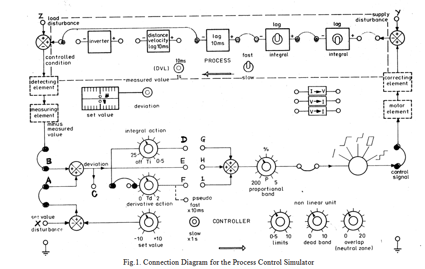
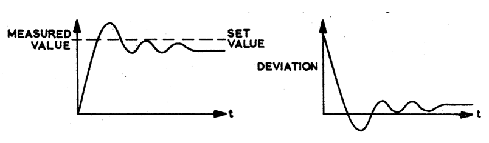

# Theory

 The Process Control Simulator is a special-purpose analogue simulator employing integrated circuit operational amplifiers.
				

    

<b style="color:blue">The Simulated Process</b>
				
The process comprises the following elements, any of which may be inserted or omitted from a complete process by the use of jumper leads. 
				
1 Simple lag of time constant 10 milliseconds or 1s

2 lags of time constant 10millseconds or 1s (each convertible by toggle switches to integrators of time constant 10 ms or 1s)

1 distance- velocity lag of delay 10 milliseconds or 1 second, selected by a toggle switch 

1 inverter 

The time constants of all the above elements can be set by one toggle switch to slow (1s) or fast (10ms) mode.
With these elements any of twelve different linear process characteristics of Type 0, 1 and 2 may be established.Every element produces a polarity inversion but the inverter may be included or not as necessary to produce the desired overall polarity.
						
<b style="color:blue">The Simulated Controller</b>

The controller is of the PID type which generates a control signal of the type 
						
$$u = k_p[e(t)+ \frac{1}{T_i}\int_{0}^{t}e(\tau)d\tau + \dot{e}(t)]$$

The Controller comprises the following elements:

1 Set-value control of range &plusmn; 10 volts

1 Comparing element 

1 Integral action control scaled in integral action time Ti

1 Derivative action control scaled in derivative action time Td

1 Proportional band control scaled in % proportional band PB = 100/Kp

The comparing element generates the deviation as the difference between the controlled condition and
the set value and passes it to the three–term controller comprising the integral, derivatives, and proportional controls.To avoid problems due to integrator drift an OFF position is provided on the integral action control in which the integral term at held at zero.

Meter Indicator: two center-zero meters indicate the set value (lower meter) and either the measured value or the deviation (upper meter} according to the switch position selected. The sense of the meters is arranged to ensure correct polarities according to the equation
						
<b>Deviation = Measured Value - Set Value</b>
						
<b style="color:blue">Proportional Control System Response</b>
						
Refer to Fig 1 the jumper E to H is connected to apply proportional control.At point A a square wave signal of amplitude 5V p-p and frequency about 0.05Hz is Injected into the system.Alternatively the SET VALUE DISTURBANCE from point X and the negative MEASURED VALUE from the point B are displayed on an oscilloscope ,
with both PROCESS and CONTROLLER switches at FAST, and input signal frequency 1.0Hz.
						
The meter switched to DEVIATION or display from point C and changes in DEVIATION are noted as disturbances are applied.Final setting points of both MEASURED VALUE and DEVIATION are noted.Tests with a percentage PROPORTIONAL BAND set at 50 and then 5 are done. 
						
<b>Summary:</b>

The system moves slowly towards the SET VALUE. When it has there exists a considerable DEVIATION. As the percentage PROPORTIONAL BAND is reduced, i.e,the gain of the system is increased, the steady state DEVIATION is reduced and the system settles with its MEASURED VALUE much closer to the SET VALUE.In order to reduce the steady state DEVIATION to zero, however, the gain must be increased to such a value that the system becomes completely unstable.A compromise gain level must be used which maintains, a steady state deviation signal.
						
The system response is shown below.
						

					  

						
<b style="color:blue">Proportional Plus Integral Control:</b> 

The jumper D to G is connected for integral action.A square wave of 5V p-p or 1.0 Hz is applied to the SET VALUE DISTURBANCE socket X . The proportional band control is adjusted to 50 and it is adjusted until the system settles with about four overshoots only after each disturbance.Continuous oscillation should commence at a value of about 12.DEVIATION socket C is monitored and the setting on INTEGRAL ACTION control is slowly reduced until DEVIATION falls to zero after each disturbance.The number of overshoots before it settles are noted.The output of the integrator socket D when the system has settled is noted.The difference between MEASURED and SET VALUE is noted. The INTEGRAL ACTION control is reduced to 10 and the responses of system is noted.

<b>Summary:</b> By suitable adjustment of the integrator time constant the steady state DEVIATION can be reduced to zero. In consequence the MEASURED VALUE becomes much closer to SET VALUE.Too much integral term however causes the system to go into oscillation. Generally speaking an increase in the integral term reduces steady state deviation but increases the time the system takes to settle. 

<b style="color:blue">Proportional + Integral+ Derivative Control:</b> 

Derivative Control: As was seen, integral control improves the performance of the control system in some respects, i.e., reduces steady state DEVIATION, but has the disadvantage of slowing down the overall response time.If a system was required to follow a sudden change in SET VALUE this would give rise to rapid change in the DEVIATION. Although this deviation change is rapid the system responds rather slowly, so if at this time controller output could be boosted ,the speed of system response could be improved. If the deviation was differentiated i.e. its rate of change measured, and a signal produced proportional to this and then added to the signals from the proportional and integrator sections, some improvement should result.
						
All switches and controls as in Fig l are set,the jumper for all the control actions are connected.A square wave input of 5V p-p or 1.0Hz is applied to the SET VALUE DISTERBANCE socket .INTEGRAL ACTION is adjusted until steady state deviation is zero. After a disturbance the steady state deviation and number of overshoots are noted before the system settles.The DERIVATIVE ACTION control is slowly increased and the effect this has upon the system response is noted. If this has any effect upon this steady state DEVIATION is also checked.

<b>Summary:</b> Application of the DERIVATIVE TERM does not have any effect upon the steady state deviation but does reduce the settling time by reducing the number of oscillation.

						
						
								