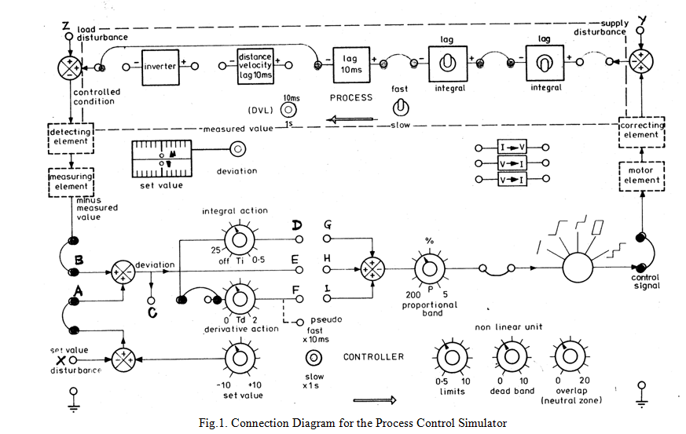

### Procedure
				
**Schematic of the Process Simulator Plant**

          

**Steps to perform the simulation**

<b style="color:blue">P-Control</b>

1. At first connect the circuit diagram properly through the connecting dots(blue dots)in the Process Simulator kit below the oscilloscope section,according to below instruction.2-7,8-9,10-11,12-13,21-22,23-24,37-38,39-40,28-29,25-26,23-42,44-42,46-43,46-25 and 32-35 for proportional control.45-22,45-27 connections can be done for showing output signal or deviation signal respectively in oscilloscope channel-2 alternatively.
  
2. Click on 'Check Connection' button to check whether the connection is proper or not.Then click on the 'Power' button to switch on the oscilloscope.
					 
3. Click on "Square" button(twice) to observe input signal. Apply amplitude to 5vp-p,Frequency 0.2Hz.
					 
4. Apply 50 percent proportional band by rotating the 'proportional band' knob by clicking on the plus sign on it. 

5. Now click on 'Output' button to observe the output signal and enlarged signal plot for that particular proportional band.Channel-1 will show the input,Channel-2 will show the output and 'Dual' shows the both.In the plot below zoom in the overshoot part of the curve by selecting that part. Enter the peak value and steady state value in respective input boxes.Click on'Calculate' button.Observe the Steady state Error,Percentage Overshoot.Now delete connection 45-22 by clicking on the connection and connect 45-27,click on 'Check Connection' button to check whether the connection is proper or not. Now follow above 
steps to observe the deviation signal. 					 
					 
6. Click on 'Clear' button each time after one observation.Check output and deviation for 30,200,5 percent proportional band in same way.
					 

<b style="color:blue">P-I Control</b>

1. At first connect the circuit diagram properly through the connecting dots(blue dots)in the Process Simulator kit below the oscilloscope section,according to below instruction.2-7,8-9,10-11,12-13,21-22,23-24,37-38,39-40,28-29,25-26,23-42,44-42,46-43,46-25 and 32-35,30-31 for proportional Integral control.45-22,45-27 connections can be done for showing output signal or deviation signal respectively in oscilloscope channel-2 alternatively.
  
2. Click on 'Check Connection' button to check whether the connection is proper or not.Then click on the 'Power' button to switch on the oscilloscope.
					 
3. Click on "Square" button(twice) to observe input signal. Apply amplitude to 5vp-p,Frequency 1Hz. 
					 
4. Apply 50 percent proportional band by rotating the 'proportional band' knob(this is fixed value) and apply integral time 2 by rotating the 'integral action' knob by clicking on the plus sign on it .

5. Now click on 'Output' button to observe the output signal and the enlarged signal plot for that particular integral time.Channel-1 will show the input,Channel-2 will show the output and 'Dual' shows the both.In the plot below zoom in the overshoot part of the curve by selecting that part. Enter the peak value and steady state value(if overshoots are there) in respective input boxes.Click on'Calculate' button.Observe the Steady state Error,Percentage Overshoot.Now delete connection 45-22 by clicking on the connection and connect 45-27,
click on 'Check Connection' button to check whether the connection is proper or not. Now follow above steps to observe the deviation signal. 
					 
6. Click on 'Clear' button each time after one observation.Check output and deviation by setting integral time to 5,10,25 in same way.

					 
<b style="color:blue">P-I-D Control</b>

1. At first connect the circuit diagram properly through the connecting dots(blue dots)in the Process Simulator kit below the oscilloscope section,according to below instruction.2-7,8-9,10-11,12-13,21-22,23-24,37-38,39-40,28-29,25-26,23-42,44-42,46-43,46-25 and 32-35,30-31,33-36 for proportional Integral Derivative control.45-22,45-27 connections can be done for showing output signal or deviation signal respectively in oscilloscope channel-2 alternatively.

2. Click on 'Check Connection' button to check whether the connection is proper or not.Then click on the 'Power' button to switch on the oscilloscope.
					 
3. Click on "Square" button(twice) to observe input signal. Apply amplitude to 5vp-p,Frequency 1Hz. 
					 
4. Apply 50 percent proportional band by rotating the 'proportional band' knob(this is fixed value) and apply integral time 2 by rotating the 'integral action' knob(this is fixed value) ,apply derivative time to 2 by rotating the 'Derivative action' knob by clicking on the plus sign on it. 

5. Now click on 'Output' button to observe the output signal and the enlarged signal plot for that particular derivative time.Channel-1 will show the input,Channel-2 will show the output and 'Dual' shows the both.In the plot below zoom in the overshoot part of the curve by selecting that part. Enter the peak value and steady state value(if overshoots are there) in respective input boxes.Click on'Calculate' button.Observe the Steady state Error,Percentage Overshoot.Check the steady state error,percentage overshoot are decreased in the output after P-I-D Control.Now delete connection 45-22 by clicking on the connection and connect 45-27,Click on 'Check Connection' button to check whether the connection is proper or not. Now follow above steps to observe the deviation signal.
						

		  